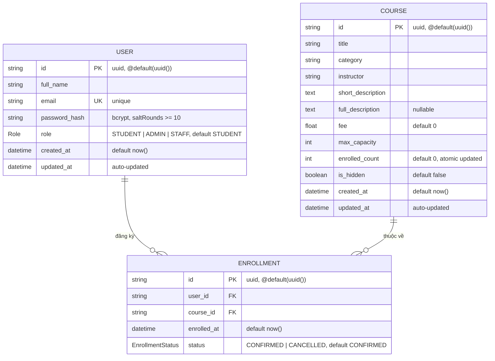

# Sơ đồ Thực thể — Mối quan hệ (ERD)

**Dự án:** PKS Course & Enrollment Portal  
**Database:** PostgreSQL  
**ORM:** Prisma v6  
**Schema file:** [`backend/prisma/schema.prisma`](../backend/prisma/schema.prisma)

---

## Sơ đồ ERD (Mermaid)



---

## Chi tiết các Bảng

### Bảng `users`

| Cột | Kiểu dữ liệu | Ràng buộc | Mô tả |
|---|---|---|---|
| `id` | `VARCHAR` (UUID) | `PK`, `NOT NULL` | Khóa chính, tự sinh UUID |
| `full_name` | `VARCHAR` | `NOT NULL` | Họ và tên người dùng |
| `email` | `VARCHAR` | `NOT NULL`, `UNIQUE` | Email dùng để đăng nhập |
| `password_hash` | `VARCHAR` | `NOT NULL` | Mật khẩu đã mã hóa bcrypt (salt >= 10) |
| `role` | `ENUM` | `NOT NULL`, `DEFAULT 'STUDENT'` | `STUDENT` / `ADMIN` / `STAFF` |
| `created_at` | `TIMESTAMPTZ` | `NOT NULL`, `DEFAULT NOW()` | Thời điểm tạo tài khoản |
| `updated_at` | `TIMESTAMPTZ` | `NOT NULL`, auto-update | Thời điểm cập nhật gần nhất |

### Bảng `courses`

| Cột | Kiểu dữ liệu | Ràng buộc | Mô tả |
|---|---|---|---|
| `id` | `VARCHAR` (UUID) | `PK`, `NOT NULL` | Khóa chính, tự sinh UUID |
| `title` | `VARCHAR` | `NOT NULL` | Tên khóa học |
| `category` | `VARCHAR` | `NOT NULL` | Danh mục (vd: Frontend, Backend, DevOps) |
| `instructor` | `VARCHAR` | `NOT NULL` | Tên giảng viên phụ trách |
| `short_description` | `TEXT` | `NOT NULL` | Mô tả ngắn hiển thị trên card |
| `full_description` | `TEXT` | `NULLABLE` | Mô tả chi tiết trên trang detail |
| `fee` | `DOUBLE PRECISION` | `NOT NULL`, `DEFAULT 0` | Học phí (VND) |
| `max_capacity` | `INTEGER` | `NOT NULL` | Sĩ số tối đa cho phép |
| `enrolled_count` | `INTEGER` | `NOT NULL`, `DEFAULT 0` | Số học viên đã ghi danh (atomic update) |
| `is_hidden` | `BOOLEAN` | `NOT NULL`, `DEFAULT false` | Ẩn khóa học khỏi danh sách công khai |
| `created_at` | `TIMESTAMPTZ` | `NOT NULL`, `DEFAULT NOW()` | Thời điểm tạo |
| `updated_at` | `TIMESTAMPTZ` | `NOT NULL`, auto-update | Thời điểm cập nhật gần nhất |

### Bảng `enrollments`

| Cột | Kiểu dữ liệu | Ràng buộc | Mô tả |
|---|---|---|---|
| `id` | `VARCHAR` (UUID) | `PK`, `NOT NULL` | Khóa chính, tự sinh UUID |
| `user_id` | `VARCHAR` (UUID) | `NOT NULL`, `FK → users.id` | Tham chiếu học viên |
| `course_id` | `VARCHAR` (UUID) | `NOT NULL`, `FK → courses.id` | Tham chiếu khóa học |
| `enrolled_at` | `TIMESTAMPTZ` | `NOT NULL`, `DEFAULT NOW()` | Thời điểm ghi danh |
| `status` | `ENUM` | `NOT NULL`, `DEFAULT 'CONFIRMED'` | `CONFIRMED` / `CANCELLED` |

**Index đặc biệt:**
- `UNIQUE (user_id, course_id)` — tên `user_course_unique`: ngăn một học viên ghi danh vào cùng một khóa học nhiều lần.

---

## Quan hệ giữa các Bảng

```
users (1) ──────────── (N) enrollments
                              │
courses (1) ────────── (N) enrollments
```

| Quan hệ | Loại | Mô tả |
|---|---|---|
| `User` → `Enrollment` | One-to-Many | Một học viên có thể ghi danh nhiều khóa học |
| `Course` → `Enrollment` | One-to-Many | Một khóa học có nhiều học viên ghi danh |
| `User` ↔ `Course` | Many-to-Many | Thông qua bảng trung gian `Enrollment` |

**Cascade Delete:**
- Xóa `User` → xóa toàn bộ `Enrollment` liên quan.
- Xóa `Course` → xóa toàn bộ `Enrollment` liên quan.

---

## Enum Types

### `Role`
| Giá trị | Mô tả |
|---|---|
| `STUDENT` | Học viên — Ghi danh, xem khóa học của mình |
| `ADMIN` | Quản trị viên — Toàn quyền CRUD + xem danh sách ghi danh |
| `STAFF` | Nhân viên — Tương tự Admin, quản lý khóa học |

### `EnrollmentStatus`
| Giá trị | Mô tả |
|---|---|
| `CONFIRMED` | Ghi danh đã được xác nhận |
| `CANCELLED` | Ghi danh đã bị hủy |

---

## Cơ chế chống Race Condition

Khi nhiều học viên đồng thời ghi danh vào cùng một khóa học sắp đầy:

```sql
-- Prisma Transaction + Atomic Update
UPDATE courses
SET enrolled_count = enrolled_count + 1
WHERE id = $courseId
  AND enrolled_count < max_capacity;   -- ← điều kiện khóa capacity

-- Nếu affected rows = 0 → khóa học đã đầy → rollback + throw BadRequestException
```

Đây là kỹ thuật **Optimistic Locking qua Atomic Conditional Update** — không cần `SELECT FOR UPDATE` nhưng vẫn đảm bảo tính nhất quán dữ liệu.
