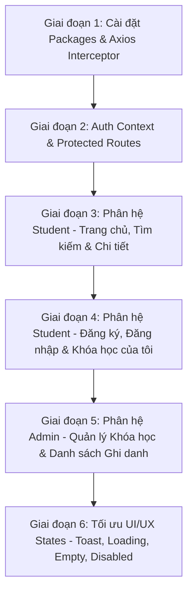

# TRÌNH TỰ THỰC HIỆN CHI TIẾT FRONTEND (REACT.JS + VITE + TYPESCRIPT)
> **Mục tiêu**: Hoàn thành 100% yêu cầu đề bài PDF và đạt điểm tối đa (2.5/2.5đ Frontend & UI/UX + 1.5/1.5đ Protected Routes & RBAC).

---

## 📋 TỔNG QUAN CÁC BƯỚC THỰC HIỆN FRONTEND



---

## 🛠️ GIAI ĐOẠN 1: CÀI ĐẶT PACKAGES & NỀN TẢNG DỰ ÁN

### Bước 1.1: Cài đặt các thư viện cần thiết
Thực hiện tại thư mục `frontend`:
```bash
cd frontend
npm install react-router-dom axios react-hot-toast lucide-react
```

### Bước 1.2: Cấu hình Axios Client (`src/api/axiosClient.ts`)
Tạo instance Axios tự động đính kèm Token JWT vào Header và tự động bắt lỗi:
```typescript
import axios from 'axios';

const axiosClient = axios.create({
  baseURL: 'http://localhost:3000/api/v1', // Đường dẫn Backend API
  headers: {
    'Content-Type': 'application/json',
  },
});

// Interceptor đính kèm Token
axiosClient.interceptors.request.use((config) => {
  const token = localStorage.getItem('accessToken');
  if (token) {
    config.headers.Authorization = `Bearer ${token}`;
  }
  return config;
});

export default axiosClient;
```

---

## 🔐 GIAI ĐOẠN 2: AUTH CONTEXT & PROTECTED ROUTES

### Bước 2.1: Quản lý Trạng thái Đăng nhập (`src/context/AuthContext.tsx`)
- Lưu trữ `user`, `accessToken`, `isAuthenticated`, `isAdmin`.
- Cung cấp hàm `login()`, `logout()`, `register()`.

### Bước 2.2: Bảo vệ Đường dẫn (`src/components/ProtectedRoutes.tsx`)
1. **`ProtectedRoute`**: Bắt buộc phải đăng nhập, nếu chưa đăng nhập -> Redirect đến `/login`.
2. **`AdminRoute`**: Bắt buộc phải đăng nhập VÀ có `user.role === 'ADMIN'` hoặc `'STAFF'`, nếu là Student -> Redirect đến `/` hoặc hiển thị 403 Forbidden.

---

## 🎓 GIAI ĐOẠN 3: PHÂN HỆ STUDENT - DANH SÁCH & CHI TIẾT KHÓA HỌC

### Bước 3.1: Component Card Khóa học (`src/components/CourseCard.tsx`)
- Hiển thị: Tên khóa học, Danh mục, Giảng viên, Mô tả ngắn, Học phí (format VND), Sĩ số (Đã đăng ký / Tối đa).
- **Badge Trạng thái**:
  - `Còn chỗ` (Badge xanh): Khi `enrolledCount < maxCapacity`.
  - `Hết chỗ` (Badge đỏ): Khi `isFull === true` hoặc `enrolledCount >= maxCapacity`.

### Bước 3.2: Trang chủ / Danh sách khóa học (`src/pages/HomePage.tsx`)
- Thanh tìm kiếm theo Tên (`search`).
- Bộ lọc theo Danh mục (`category`).
- Trạng thái UI:
  - **Loading State**: Hiển thị Spinner / Skeleton.
  - **Empty State**: Hiển thị "Không tìm thấy khóa học nào phù hợp".

### Bước 3.3: Trang Chi tiết & Ghi danh (`src/pages/CourseDetailPage.tsx`)
- Hiển thị mô tả chi tiết bài học.
- **Nút "Ghi danh khóa học"**:
  - Khi chưa đăng nhập -> Click chuyển hướng sang `/login`.
  - Khi khóa học Hết chỗ -> Button bị `disabled` với text "Khóa học đã hết chỗ".
  - Khi đang gửi request -> Button `disabled` kèm icon Loading spinner.
  - Khi ghi danh thành công -> Hiển thị Toast Notification xanh `Ghi danh thành công!`.

---

## 👤 GIAI ĐOẠN 4: PHÂN HỆ STUDENT - AUTH & KHÓA HỌC CỦA TÔI

### Bước 4.1: Trang Đăng ký (`src/pages/RegisterPage.tsx`)
- Form gồm: Họ tên, Email, Mật khẩu.
- Xử lý lỗi trùng Email qua Toast Notification màu đỏ.

### Bước 4.2: Trang Đăng nhập (`src/pages/LoginPage.tsx`)
- Form gồm: Email, Mật khẩu.
- Đăng nhập thành công -> Lưu Token vào `localStorage` và chuyển về Trang chủ `/`.

### Bước 4.3: Trang Khóa học của tôi (`src/pages/MyCoursesPage.tsx`)
- Gọi API `GET /enrollments/my-courses`.
- Bảng/Card các khóa học cá nhân đã đăng ký, Ngày ghi danh (`YYYY-MM-DD`), Trạng thái ghi danh.

---

## 👑 GIAI ĐOẠN 5: PHÂN HỆ ADMIN - QUẢN LÝ KHÓA HỌC & HỌC VIÊN

### Bước 5.1: Trang Quản lý Khóa học Admin (`src/pages/admin/AdminCoursesPage.tsx`)
- Bảng danh sách tất cả khóa học (Bao gồm cả khóa học ẩn).
- **Nút "Thêm khóa học mới"**: Mở Modal Form nhập thông tin.
- **Nút "Sửa"**: Mở Modal Form chỉnh sửa. Validate phía Client/Backend: Không cho hạ `maxCapacity` nhỏ hơn `enrolledCount`.
- **Nút "Ẩn/Hiện" / "Xóa"**.

### Bước 5.2: Trang Xem Danh sách Học viên (`src/pages/admin/AdminEnrollmentsPage.tsx`)
- Chọn từng khóa học để xem bảng danh sách học viên đã ghi danh.
- Hiển thị: Họ tên, Email, Ngày ghi danh (`YYYY-MM-DD`), Trạng thái (`CONFIRMED`).

---

## 🎨 GIAI ĐOẠN 6: CHUẨN HOÁ GIAO DIỆN & UX STATES (ĐIỂM TỐI ĐA 2.5đ)

| Trạng thái UX | Yêu cầu Đề bài PDF | Giải pháp Thực hiện |
|---|---|---|
| **Toast Notification** | Không dùng `alert()` mặc định | Sử dụng `react-hot-toast` cho tất cả thông báo Thành công / Thất bại |
| **Loading State** | Hiệu ứng chờ dữ liệu | Cấu hình Spinner SVG / CSS skeleton khi gọi API |
| **Empty State** | Trạng thái rỗng | Component `EmptyState` thân thiện khi danh sách bằng 0 |
| **Disabled State** | Vô hiệu hóa hành động | Attribute `disabled` trên Button khi `isSubmitting` hoặc Khóa học đầy |
| **Responsive** | Desktop & Mobile | Thiết kế Grid/Flexbox co giãn chuẩn trên các kích thước màn hình |

---

## 💯 CHECKLIST ĐỐI CHIẾU TIÊU CHÍ FRONTEND (2.5/2.5Đ)

- [x] **Responsive (1.0đ)**: Tương thích trên cả Máy tính & Điệp thoại.
- [x] **Gọi API Danh sách & Chi tiết (1.0đ)**: Tìm kiếm, Lọc danh mục, Xem chi tiết, Ghi danh.
- [x] **Login / Logout (0.5đ)**: Lưu JWT Token, duy trì trạng thái đăng nhập, đăng xuất.
- [x] **UX Feedback**: Đầy đủ Loading, Empty State, Disabled Button, Toast Notification.
- [x] **Phân quyền Admin / Student**: Protected Routes ngăn chặn Student truy cập trang Admin.
