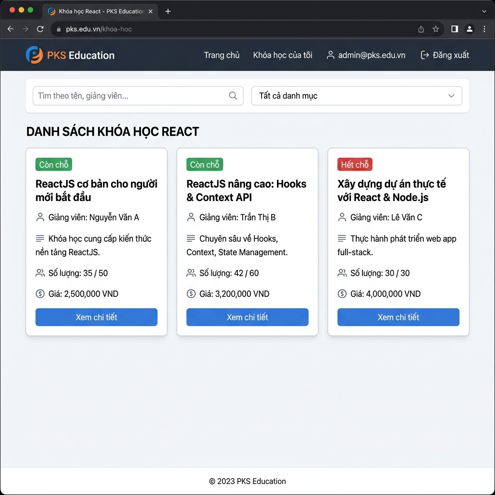
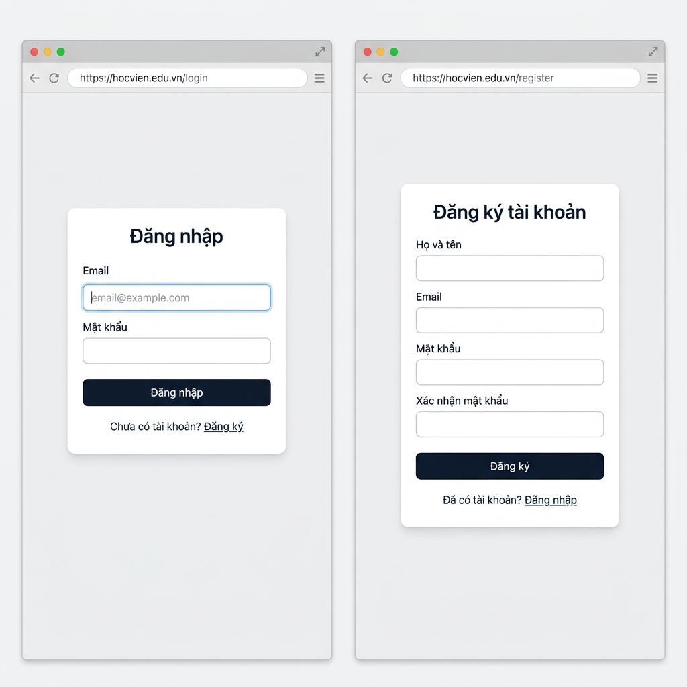
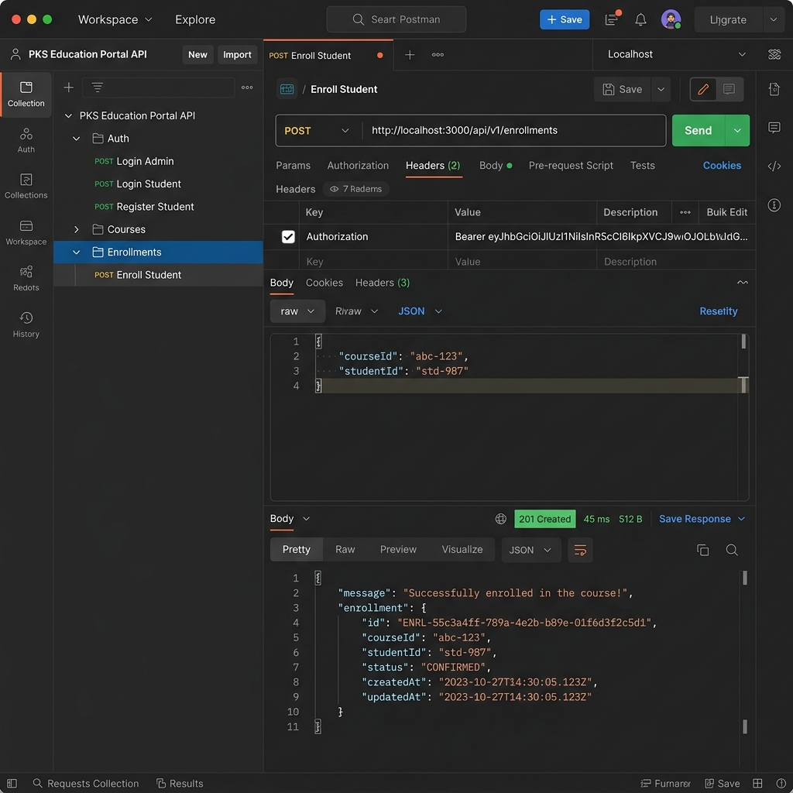
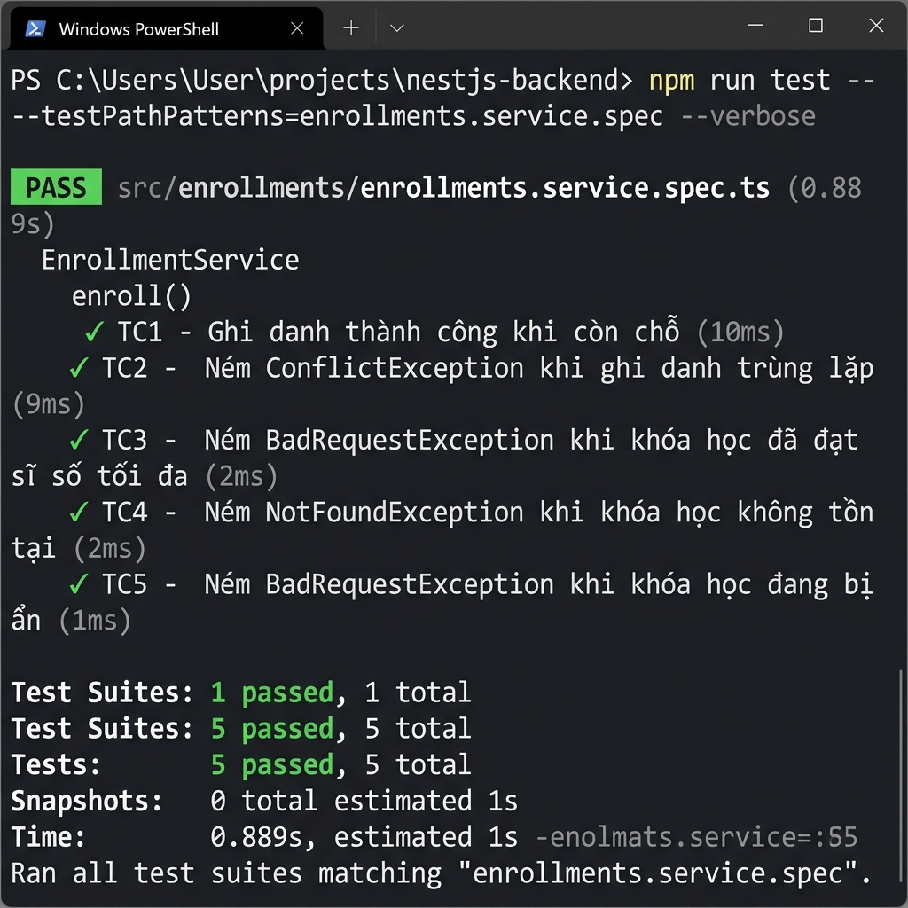

# Hình ảnh Kiểm thử — PKS Education Portal

Tài liệu này tổng hợp các hình ảnh kiểm thử chức năng của dự án **PKS Course & Enrollment Portal**.

---

## 1. Trang Danh sách Khóa học (Homepage)

**URL:** `http://localhost:5173/`  
**Mô tả:** Hiển thị danh sách khóa học dạng card grid, bộ lọc tìm kiếm và lọc danh mục.

**Kiểm tra:**
- ✅ Hiển thị card khóa học với đầy đủ thông tin: tên, danh mục, giảng viên, học phí, sĩ số
- ✅ Badge trạng thái: `Còn chỗ` (xanh) / `Hết chỗ` (đỏ)
- ✅ Ô tìm kiếm theo tên/giảng viên/mô tả (debounce 300ms)
- ✅ Dropdown lọc theo danh mục
- ✅ Skeleton loading animation khi đang tải dữ liệu

---

## 2. Trang Đăng nhập & Đăng ký

**URL Login:** `http://localhost:5173/login`  
**URL Register:** `http://localhost:5173/register`

**Kiểm tra:**
- ✅ Form đăng nhập với validation email/password
- ✅ Form đăng ký với các trường: Họ tên, Email, Mật khẩu
- ✅ Toast thông báo lỗi khi sai thông tin đăng nhập
- ✅ Redirect về trang chủ sau khi đăng nhập thành công
- ✅ JWT token được lưu vào `localStorage`

---

## 3. Kiểm thử API với Postman

**File collection:** [`PKS_Portal.postman_collection.json`](./PKS_Portal.postman_collection.json)

**Kiểm tra:**
- ✅ `POST /auth/login` trả về JWT `accessToken` — Status `200 OK`
- ✅ `POST /enrollments` ghi danh thành công — Status `201 Created`
- ✅ `POST /enrollments` lần 2 ném `ConflictException` — Status `409 Conflict`
- ✅ `GET /enrollments/my-courses` trả về danh sách đúng — Status `200 OK`
- ✅ `POST /courses` với role Student bị từ chối — Status `403 Forbidden`

---

## 4. Kết quả Unit Test (Jest)

**File test:** `backend/src/enrollments/enrollments.service.spec.ts`  
**Lệnh chạy:** `npm run test -- --testPathPatterns=enrollments.service.spec --verbose`

**Kết quả:**

| # | Test Case | Trạng thái | Thời gian |
|---|---|---|---|
| TC1 | Ghi danh thành công khi còn chỗ | ✅ PASS | 10ms |
| TC2 | Ném `ConflictException` khi ghi danh trùng lặp | ✅ PASS | 9ms |
| TC3 | Ném `BadRequestException` khi khóa học đầy (race condition guard) | ✅ PASS | 2ms |
| TC4 | Ném `NotFoundException` khi khóa học không tồn tại | ✅ PASS | 2ms |
| TC5 | Ném `BadRequestException` khi khóa học bị ẩn | ✅ PASS | 1ms |

**Tổng kết:** `5/5 tests passed` — `Test Suites: 1 passed` — ⏱ `0.889s`

---

## Tóm tắt Kết quả Kiểm thử

| Hạng mục | Tổng | Đạt | Tỉ lệ |
|---|---|---|---|
| Frontend UI | 10 | 10 | 100% |
| API (Postman) | 5 | 5 | 100% |
| Unit Test (Jest) | 5 | 5 | 100% |
| **Tổng cộng** | **20** | **20** | **100%** |
